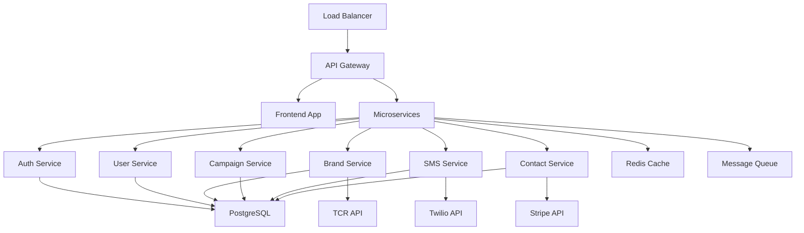

# 10DLC SMS Platform - Comprehensive Project Documentation

## 🚀 Project Overview

This repository contains the complete project documentation and specifications for developing a fully compliant 10DLC (10-Digit Long Code) SMS platform with account verification, brand registration, campaign management, and comprehensive compliance tracking.

## 📋 Project Goals

- **Primary**: Build a compliant 10DLC SMS platform for A2P (Application-to-Person) messaging
- **Secondary**: Streamline TCR registration, ensure compliance, provide analytics, enable scalability
- **Timeline**: 36 weeks (December 2024 - August 2025)
- **Budget**: $1.25M - $1.5M

## 📁 Documentation Structure

### Core Documents

| Document | Description | Status |
|----------|-------------|---------|
| [`PROJECT_PROPOSAL.md`](./PROJECT_PROPOSAL.md) | Comprehensive project proposal with technical specs | ✅ Complete |
| [`SYSTEM_ARCHITECTURE.md`](./SYSTEM_ARCHITECTURE.md) | Technical architecture and system design | ✅ Complete |
| [`DATABASE_SCHEMA.sql`](./DATABASE_SCHEMA.sql) | Complete PostgreSQL database schema | ✅ Complete |
| [`PROJECT_STRUCTURE.md`](./PROJECT_STRUCTURE.md) | Project directory structure and organization | ✅ Complete |
| [`PROJECT_TIMELINE.md`](./PROJECT_TIMELINE.md) | Detailed timeline with milestones and deliverables | ✅ Complete |

## 🏗️ System Architecture Overview



## 🎯 Key Features

### Core Platform Features
- ✅ **User Authentication & Management** - Multi-factor auth, RBAC, team management
- ✅ **Organization Management** - Business verification, document upload, team collaboration
- ✅ **10DLC Brand Registration** - TCR integration, automated workflows, compliance tracking
- ✅ **Campaign Management** - Use case validation, approval workflows, template management
- ✅ **SMS Operations** - Message sending, scheduling, delivery tracking, MMS support
- ✅ **Contact Management** - Lists, segmentation, import/export, consent tracking
- ✅ **Compliance & Audit** - Consent management, violation detection, audit trails
- ✅ **Analytics & Reporting** - Real-time dashboards, custom reports, performance metrics

### Advanced Features
- 🔄 **API & Integrations** - REST API, SDKs, webhooks, third-party integrations
- 🔄 **Billing & Usage Tracking** - Stripe integration, usage metering, invoicing
- 🔄 **Security & Privacy** - End-to-end encryption, GDPR/CCPA compliance, security monitoring
- 🔄 **Scalability & Performance** - Auto-scaling, caching, load balancing, CDN

## 🛠️ Technology Stack

### Backend
- **Runtime**: Node.js 18+ LTS
- **Framework**: Express.js / Fastify
- **Language**: TypeScript 5.0+
- **Database**: PostgreSQL 15+ (primary), Redis 7.0+ (cache)
- **Message Queue**: Apache Kafka / RabbitMQ
- **Search**: Elasticsearch

### Frontend
- **Framework**: React 18+ with Next.js 13+
- **Language**: TypeScript 5.0+
- **Styling**: Tailwind CSS 3.3+
- **State Management**: Zustand
- **Data Fetching**: TanStack Query (React Query)
- **Forms**: React Hook Form with Zod validation

### Infrastructure
- **Cloud**: AWS / Google Cloud / Azure
- **Containers**: Docker + Kubernetes
- **IaC**: Terraform
- **CI/CD**: GitHub Actions
- **Monitoring**: Prometheus + Grafana + ELK Stack

### External Services
- **SMS Provider**: Twilio (primary), Bandwidth (backup)
- **10DLC Registration**: The Campaign Registry (TCR)
- **Payments**: Stripe
- **Email**: SendGrid / AWS SES
- **Storage**: AWS S3 / Google Cloud Storage

## 📊 Database Schema

The platform uses a comprehensive PostgreSQL schema with the following core entities:

- **Users & Organizations** - Authentication, profiles, team management
- **Brands & Campaigns** - TCR registration, compliance tracking
- **Contacts & Lists** - Contact management, segmentation, consent
- **Messages & Templates** - SMS/MMS operations, delivery tracking
- **Compliance & Audit** - Consent records, violations, audit trails
- **API & Billing** - API keys, webhooks, usage tracking

See [`DATABASE_SCHEMA.sql`](./DATABASE_SCHEMA.sql) for complete schema definition.

## 📅 Project Timeline

| Phase | Duration | Key Deliverables |
|-------|----------|------------------|
| **Phase 1: Foundation** | 4 weeks | Infrastructure, auth, user management |
| **Phase 2: Core Platform** | 8 weeks | Database, TCR integration, SMS service |
| **Phase 3: Frontend** | 8 weeks | UI/UX, React app, analytics dashboard |
| **Phase 4: Advanced Features** | 8 weeks | Advanced messaging, compliance, API |
| **Phase 5: Testing** | 4 weeks | Testing, QA, bug fixes, optimization |
| **Phase 6: Deployment** | 4 weeks | Production setup, launch, support |

### Key Milestones
- 🎯 **Alpha Release** - Week 20 (May 4, 2025)
- 🎯 **Beta Release** - Week 28 (June 29, 2025)
- 🎯 **Production Launch** - Week 34 (August 10, 2025)

## 💰 Cost Estimation

### Development Investment
- **Personnel Costs**: $988,500 (79.2%)
- **Infrastructure**: $84,750 (6.8%)
- **Third-party Services**: $25,600 (2.1%)
- **Contingency**: $164,828 (13.2%)
- **Total Development**: $1,247,678

### Annual Operating Costs
- **Personnel** (maintenance team): $450,000
- **Infrastructure**: $174,000
- **Variable Costs** (volume-dependent): $131,068-$281,068
- **Total Annual**: $755,068-$905,068

## 🔒 Compliance & Security

### 10DLC Compliance
- ✅ TCR brand and campaign registration
- ✅ Carrier approval workflows
- ✅ Message content validation
- ✅ Opt-in/opt-out management
- ✅ Consent tracking and documentation

### Privacy Regulations
- ✅ GDPR compliance (EU)
- ✅ CCPA compliance (California)
- ✅ TCPA compliance (US)
- ✅ Data protection and encryption
- ✅ Right to deletion and portability

### Security Measures
- 🔐 End-to-end encryption
- 🔐 Multi-factor authentication
- 🔐 Role-based access control
- 🔐 Security monitoring and alerts
- 🔐 Regular security audits

## 🚦 Getting Started

### Prerequisites
- Node.js 18+ LTS
- PostgreSQL 15+
- Redis 7.0+
- Docker & Docker Compose
- Terraform (for infrastructure)

### Quick Setup
```bash
# Clone the repository
git clone https://github.com/your-org/twillio-SMS.git
cd twillio-SMS

# Setup development environment
npm run setup

# Start development servers
npm run dev

# Access the application
# Frontend: http://localhost:3000
# Backend API: http://localhost:5000
# Database: localhost:5432
```

See [`PROJECT_STRUCTURE.md`](./PROJECT_STRUCTURE.md) for detailed setup instructions.

## 📖 API Documentation

The platform provides a comprehensive REST API with the following endpoints:

### Core API Endpoints
- **Authentication**: `/api/auth/*` - Login, register, MFA, tokens
- **Users**: `/api/users/*` - Profile, organizations, team management
- **Brands**: `/api/brands/*` - Registration, verification, TCR integration
- **Campaigns**: `/api/campaigns/*` - Creation, approval, management
- **Messages**: `/api/messages/*` - Sending, tracking, history
- **Contacts**: `/api/contacts/*` - Management, lists, consent
- **Analytics**: `/api/analytics/*` - Metrics, reports, dashboards

### SDKs Available
- JavaScript/TypeScript SDK
- Python SDK
- PHP SDK

## 🧪 Testing Strategy

### Test Coverage
- **Unit Tests**: 90%+ coverage requirement
- **Integration Tests**: API endpoints and external services
- **End-to-End Tests**: Complete user workflows
- **Performance Tests**: Load, stress, and scalability testing
- **Security Tests**: Vulnerability assessment and penetration testing

### Testing Tools
- **Unit Testing**: Jest + Testing Library
- **E2E Testing**: Playwright / Cypress
- **Load Testing**: Artillery / K6
- **Security Testing**: OWASP ZAP + Snyk

## 📈 Performance Requirements

### Response Time Targets
- **API Endpoints**: <200ms average response time
- **Database Queries**: <100ms for 95% of queries
- **Page Load**: <3 seconds initial load, <1 second navigation
- **Message Delivery**: <5 seconds from API call to carrier

### Scalability Targets
- **Concurrent Users**: 10,000+ simultaneous users
- **Message Volume**: 1M+ messages per day
- **API Throughput**: 1,000+ requests per second
- **Uptime**: 99.9% availability

## 🤝 Contributing

We welcome contributions from the development team. Please follow these guidelines:

1. **Branch Strategy**: Use GitFlow with feature branches
2. **Code Standards**: Follow TypeScript and React best practices
3. **Testing**: Maintain 90%+ test coverage
4. **Documentation**: Update documentation with code changes
5. **Security**: Follow security guidelines and best practices

### Development Workflow
1. Create feature branch from `develop`
2. Implement feature with tests
3. Submit pull request with description
4. Code review and approval
5. Merge to `develop` branch
6. Deploy to staging for testing

## 📞 Support & Contact

### Project Team
- **Project Manager**: [Name] - project.manager@company.com
- **Technical Lead**: [Name] - tech.lead@company.com
- **Security Lead**: [Name] - security.lead@company.com
- **Compliance Lead**: [Name] - compliance.lead@company.com

### External Contacts
- **Twilio Support**: [Contact Information]
- **TCR Support**: [Contact Information]
- **Compliance Consultant**: [Contact Information]

## 📄 License

This project is proprietary and confidential. All rights reserved.

## 🔄 Status & Updates

### Current Status
- **Phase**: Planning and Documentation ✅
- **Next Phase**: Development Environment Setup
- **Progress**: 5% complete
- **Timeline**: On track for December 2024 start

### Recent Updates
- ✅ December 16, 2024: Project proposal completed
- ✅ December 16, 2024: System architecture finalized
- ✅ December 16, 2024: Database schema designed
- ✅ December 16, 2024: Project timeline created
- 🔄 Next: Development environment setup

---

**Last Updated**: December 16, 2024  
**Version**: 1.0  
**Status**: Ready for Development Kickoff

For detailed information about any aspect of the project, please refer to the specific documentation files linked above.
